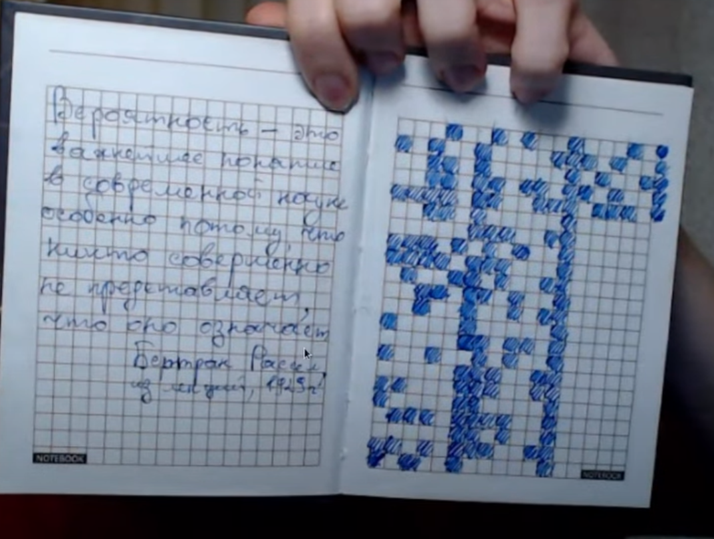
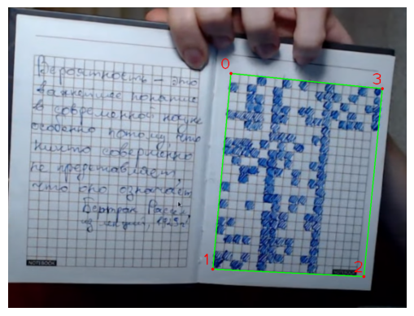
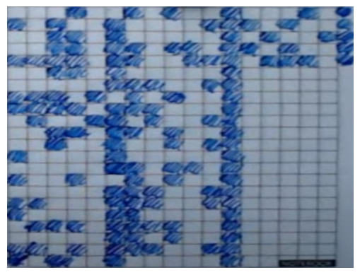
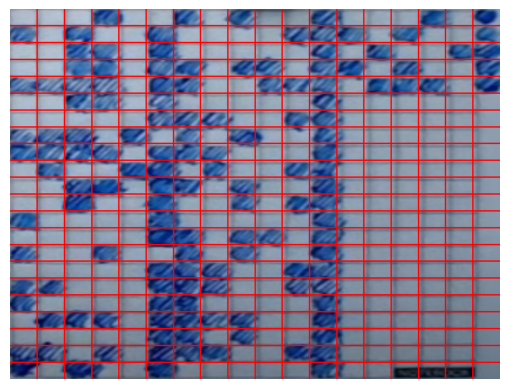
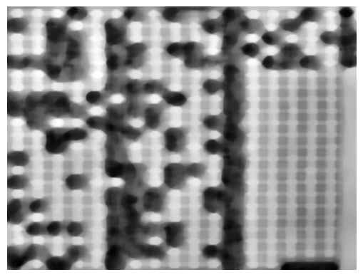
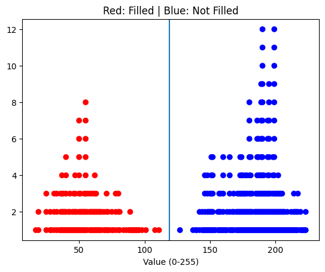
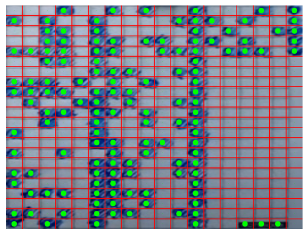

# Grid Scanner
This notebooks implements a simple grid scanner that scans a photo of a 2d grid where some cells of the grid are hashed(colored).

## Input Image
from tsoding daily youtube channel

## 1. Finding Corners
Via mouse clicks using a GUI tool

## 2. Perspective Transform
`cv2.getPerspectiveTransform()` and `cv2.warpPerspective()`

## 3. Grid lines

## 4. Processenig the Image
- `Grayscale`
- `CLAHE` contrast enhancement
- `Erode` (15,15) for 5 iterations
- `Median Blur` (ksize=31)

## 5. Visualizing Seperation
The processing has distributed the centers of our cells like this *(y axis is just the index of the cell in a given value bucket)*:

As you can see they're very seperable by thresholding the value of each cell. nice!

*Note: value of each cell is the average of a small region in that cell(near the center of the cell)*

Let's use a value like **119**.

## 6. Filled/Empty Estimation
and Done.

